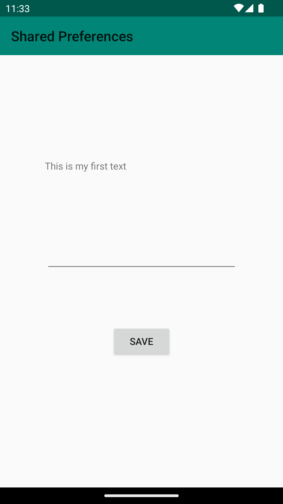
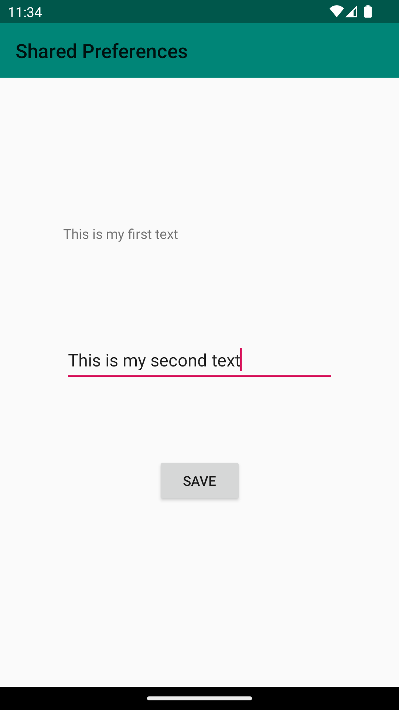
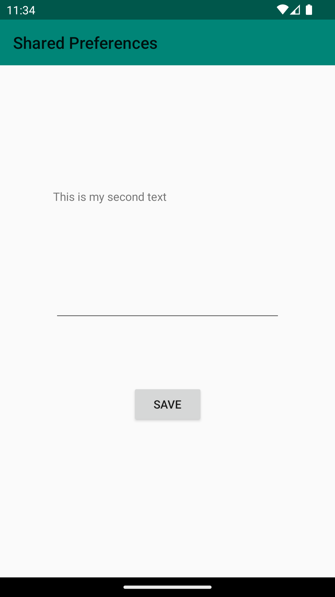

# Rapport
I forked the project and created layout for the Main Activity view. I added EditText view to 
enter the text, Button to save it and Text view to show the entered text and saved data in the 
activity_main.xml file.
```
<EditText
        android:id="@+id/settingseditview"
        android:layout_width="279dp"
        android:layout_height="48dp"
        android:layout_marginBottom="76dp"
        app:layout_constraintBottom_toTopOf="@+id/prefButton"
        app:layout_constraintEnd_toEndOf="parent"
        app:layout_constraintStart_toStartOf="parent" />
        
    <Button
        android:id="@+id/prefButton"
        android:layout_width="wrap_content"
        android:layout_height="wrap_content"
        android:layout_below="@+id/settingseditview"
        android:layout_marginBottom="188dp"
        android:onClick="savePref"
        android:text="@string/save"
        app:layout_constraintBottom_toBottomOf="parent"
        app:layout_constraintEnd_toEndOf="parent"
        app:layout_constraintStart_toStartOf="parent" />

    <TextView
        android:id="@+id/prefText"
        android:layout_width="280dp"
        android:layout_height="44dp"
        android:layout_below="@+id/prefButton"
        android:layout_marginBottom="72dp"
        app:layout_constraintBottom_toTopOf="@+id/settingseditview"
        app:layout_constraintEnd_toEndOf="parent"
        app:layout_constraintHorizontal_bias="0.496"
        app:layout_constraintStart_toStartOf="parent" />
```
I also added reference to the string recourse in the strings.xml file:
```
<string name="save">save</string>
```
I created a preference object in Main Activity class and added code to the onCreate method to get
an instance if a SharedPreference
```
 myPrefRef = getSharedPreferences("preferences", MODE_PRIVATE);
 myEdit = findViewById(R.id.settingseditview);
  
  
 protected void onCreate(Bundle savedInstanceState) {
 
        myPreferenceRef = getPreferences(MODE_PRIVATE);
        myPreferenceEditor = myPreferenceRef.edit();
 
        TextView prefTextRef=new TextView(this);
        prefTextRef=(TextView)findViewById(R.id.prefText);
        prefTextRef.setText(myPreferenceRef.getString("MyAppPreferenceString", "No preference found."));
 }  
```
I added the second activity DisplayMessageActivity and set the layout with TextView in xml file.
```
 <TextView
        android:id="@+id/prefText"
        android:layout_width="246dp"
        android:layout_height="65dp"
        app:layout_constraintBottom_toBottomOf="parent"
        app:layout_constraintEnd_toEndOf="parent"
        app:layout_constraintStart_toStartOf="parent"
        app:layout_constraintTop_toTopOf="parent"
        app:layout_constraintVertical_bias="0.499" />
```

I added onResume method to read data from the Shared Preferences.
```
protected void onResume() {
        super.onResume();
        SharedPreferences myPreferenceRef = getSharedPreferences("MyPreferencesName", MODE_PRIVATE);
        SharedPreferences.Editor myPreferenceEditor = myPreferenceRef.edit();
        myPreferenceRef = getPreferences(MODE_PRIVATE);
        myPreferenceEditor = myPreferenceRef.edit();
    }
```

I added this part of the code to the onCreate method in DisplayMessageActivity to make it able to 
read the Shared preferences.

```
myPreferenceRef = getSharedPreferences("MyPreferenceName", MODE_PRIVATE);
myPreferenceEditor = myPreferenceRef.edit();

        // Display preferences
        TextView prefTextRef=new TextView(this);
        prefTextRef=(TextView)findViewById(R.id.prefText);
        prefTextRef.setText(myPreferenceRef.getString("MyAppPreferenceString", "No preference found."));
    }
```

BASED ON THIS PROJECT I MANAGED TO GET MY SHARED PREFERENCES ON THE SAME ACTIVITY, BUT NOT ON THE 
SECOND. SO I MADE FEW CHANGES ON FEW LAST COMMITS TO MANAGE GET THE DATA ON THE SECOND ACTIVITY AND 
ON THE MAIN.

I also changed the variable names wich were to complicated:
```
     //On MainActivity
     myPrefRef = getSharedPreferences("preferences", MODE_PRIVATE);
     myEdit = findViewById(R.id.settingseditview);
     
     //On DisplayMessageActivity
     private SharedPreferences sharedPref;
     private TextView text;
```

I overwrote the previous code part in Main activity to be able to write data 
to Shared Preferences using EditText. I also created a button and SharedPreferences.Editor to be able
to modify values. All changes in an editor are batched, and not copied back to the original
SharedPreferences until apply() method is called.

```
    Button button3 = findViewById(R.id.prefButton);
    button3.setOnClickListener(new View.OnClickListener() {
   
        public void onClick(View v) {
            SharedPreferences.Editor editor = myPrefRef.edit();
            editor.putString("MyAppPreferenceString", myEdit.getText().toString());
            editor.apply();
    
            Intent intent = new Intent(MainActivity.this, DisplayMessageActivity.class);
            startActivity(intent);
            Log.d("TAG", "onClick: ");
        }
    });
```

On DisplayMessageActivity (and on MainActivity) I made able to read the data be setting the content view onCreate method
,finding the text variable by the ID and setting text in TextView widget.

```
    @SuppressLint("ResourceType")
    @Override
    protected void onCreate(Bundle savedInstanceState) {
        super.onCreate(savedInstanceState);
        setContentView(R.layout.activity_display_message);
        text = findViewById(R.id.prefText);
        sharedPref = getSharedPreferences("preferences", MODE_PRIVATE);
        String name = sharedPref.getString("MyAppPreferenceString", "null");
        text.setText(name);
        Log.d("==>", name);
    
        }
```

When we run the app we see the old entered text because it is saved in Shared preferences. This is
my App view when the button is clicked (1), when we go back to the MainActivity(2,3) and when 
Appen is closed and opened again(4).
1.
;
2.
;
3.
;
4.
;


