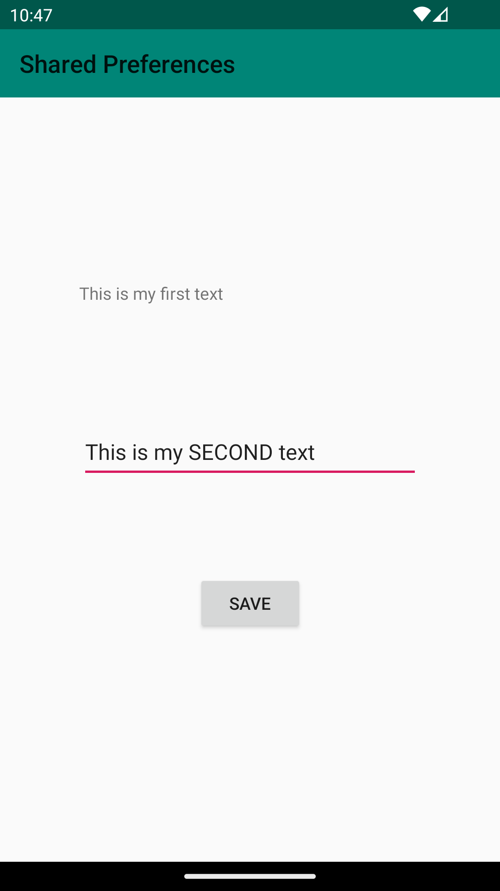
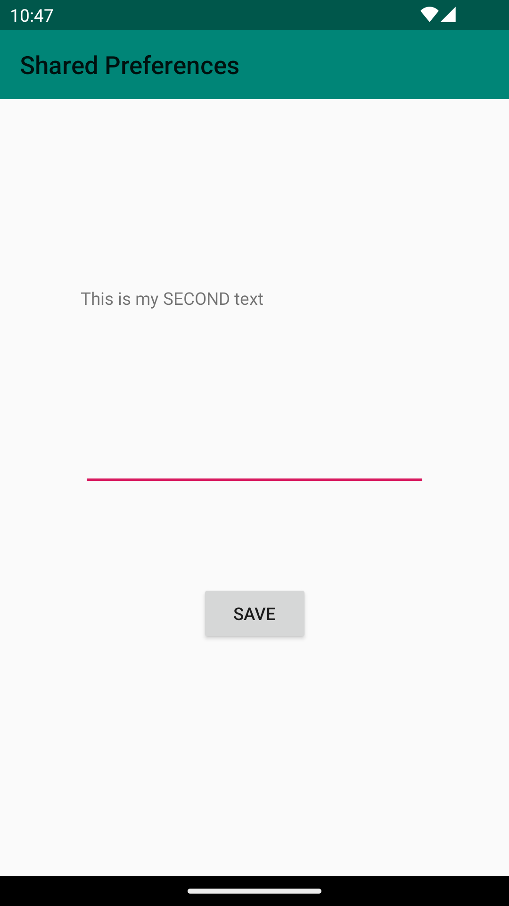

# Rapport
I forked the project and created layout for the Main Activity view. I added EditText view to 
enter the text, Button to save it and Text view to show the entered text and saved data in the 
activity_main.xml file.
```
<EditText
        android:id="@+id/settingseditview"
        android:layout_width="279dp"
        android:layout_height="48dp"
        android:layout_marginBottom="76dp"
        app:layout_constraintBottom_toTopOf="@+id/prefButton"
        app:layout_constraintEnd_toEndOf="parent"
        app:layout_constraintStart_toStartOf="parent" />
        
    <Button
        android:id="@+id/prefButton"
        android:layout_width="wrap_content"
        android:layout_height="wrap_content"
        android:layout_below="@+id/settingseditview"
        android:layout_marginBottom="188dp"
        android:onClick="savePref"
        android:text="@string/save"
        app:layout_constraintBottom_toBottomOf="parent"
        app:layout_constraintEnd_toEndOf="parent"
        app:layout_constraintStart_toStartOf="parent" />

    <TextView
        android:id="@+id/prefText"
        android:layout_width="280dp"
        android:layout_height="44dp"
        android:layout_below="@+id/prefButton"
        android:layout_marginBottom="72dp"
        app:layout_constraintBottom_toTopOf="@+id/settingseditview"
        app:layout_constraintEnd_toEndOf="parent"
        app:layout_constraintHorizontal_bias="0.496"
        app:layout_constraintStart_toStartOf="parent" />
```
I also added reference to the string recourse in the strings.xml file:
```
<string name="save">save</string>
```
I created a preferenc object in Main Activity class and added code to the onCreate method to get
an instance if a SharedPreference
```
 private SharedPreferences myPreferenceRef;
 private SharedPreferences.Editor myPreferenceEditor;
  
  
 protected void onCreate(Bundle savedInstanceState) {
 
        myPreferenceRef = getPreferences(MODE_PRIVATE);
        myPreferenceEditor = myPreferenceRef.edit();
 
        TextView prefTextRef=new TextView(this);
        prefTextRef=(TextView)findViewById(R.id.prefText);
        prefTextRef.setText(myPreferenceRef.getString("MyAppPreferenceString", "No preference found."));
 }  
```
I added the second activity DisplayMessageActivity and set the layout with TextView in xml file.
```
 <TextView
        android:id="@+id/prefText"
        android:layout_width="246dp"
        android:layout_height="65dp"
        app:layout_constraintBottom_toBottomOf="parent"
        app:layout_constraintEnd_toEndOf="parent"
        app:layout_constraintStart_toStartOf="parent"
        app:layout_constraintTop_toTopOf="parent"
        app:layout_constraintVertical_bias="0.499" />
```

I added onResume method to read data from the Shared Preferences.
```
protected void onResume() {
        super.onResume();
        SharedPreferences myPreferenceRef = getSharedPreferences("MyPreferencesName", MODE_PRIVATE);
        SharedPreferences.Editor myPreferenceEditor = myPreferenceRef.edit();
        myPreferenceRef = getPreferences(MODE_PRIVATE);
        myPreferenceEditor = myPreferenceRef.edit();
    }
```

I added this part of the code to the onCreate method in DisplayMessageActivity to make it able to 
read the Shared preferences.

```
myPreferenceRef = getSharedPreferences("MyPreferenceName", MODE_PRIVATE);
myPreferenceEditor = myPreferenceRef.edit();

        // Display preferences
        TextView prefTextRef=new TextView(this);
        prefTextRef=(TextView)findViewById(R.id.prefText);
        prefTextRef.setText(myPreferenceRef.getString("MyAppPreferenceString", "No preference found."));
    }
```

When we run the app we see the old entered text because it is saved in Shared preferences. This is
my App view before and after closing the App.



